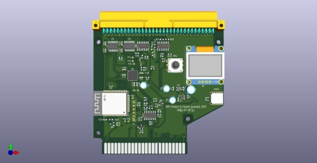
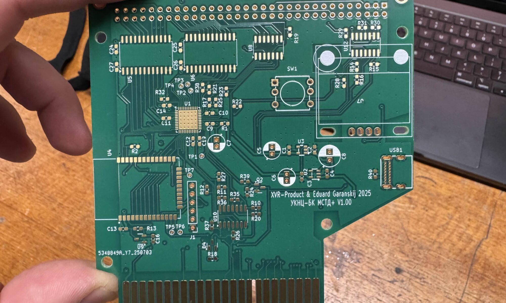

**UKNC-BK MSTD+**

**UKNC-BK MSTD+** is a universal external mass storage device designed to work simultaneously with two Soviet-era 16-bit computers from the 1980s: the *Elektronika BK0010/0011* and the *Elektronika MS0511 (UKNC)*.

<https://en.wikipedia.org/wiki/Electronika_BK>

<https://en.wikipedia.org/wiki/UKNC>

Both machines are based on the K1801 series CPUs, which are compatible with the DEC PDP-11 instruction set and use a simplified version of the DEC UNIBUS-like MPI system bus.\
[Wiki MPI BUS (In Russian)](https://ru.wikipedia.org/wiki/%D0%9C%D0%B0%D0%B3%D0%B8%D1%81%D1%82%D1%80%D0%B0%D0%BB%D1%8C%D0%BD%D1%8B%D0%B9_%D0%BF%D0%B0%D1%80%D0%B0%D0%BB%D0%BB%D0%B5%D0%BB%D1%8C%D0%BD%D1%8B%D0%B9_%D0%B8%D0%BD%D1%82%D0%B5%D1%80%D1%84%D0%B5%D0%B9%D1%81)

While the physical connectors differ between the two systems (UKNC using an extended version), they are logically compatible.

To accommodate both, the board features two separate bus connectors—one for each computer.

**Key Features**

•	**Hardware**: Built on an ICE40UP5K FPGA and an ESP32 microcontroller.

•	**Display**: Includes a small OLED screen for disk image selection and device configuration.

•	**Storage**: Does **not** use SD cards. Disk images are uploaded via **Wi-Fi** and stored in the device’s internal Flash memory.

•	**Power**: USB-C connector is used **only for additional power supply**.

•	**Compatibility**: Works with both BK0010/BK0011 and UKNC (MS0511) computers.

**Current Status (July 2027)**

•	Custom PCB designed in KiCad

•	Hardware assembly and testing in progress\

**Additional Resources**

•	📺 **Elektronika MS0511 (UKNC) Review**

*The Clueless Engineer*

[Watch on YouTube](https://www.youtube.com/watch?v=qSb77XoAgPw&ab_channel=TheCluelessEngineer)

•	📚 **DEC PDP-11 Instruction Set Reference**

Official DEC documentation archive

[View PDF](https://www.bitsavers.org/pdf/dec/pdp11/handbooks/PDP11_Handbook_1981.pdf)

•	🖥️ **UKNC Emulator**

Cross-platform emulator for Elektronika MS0511

[GitHub Repository](https://github.com/sergev/ukncbtl)

